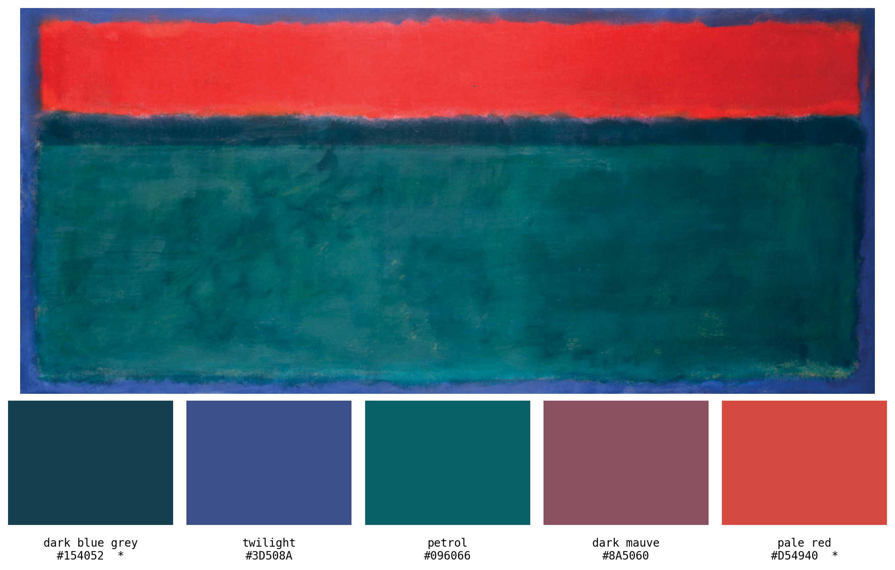
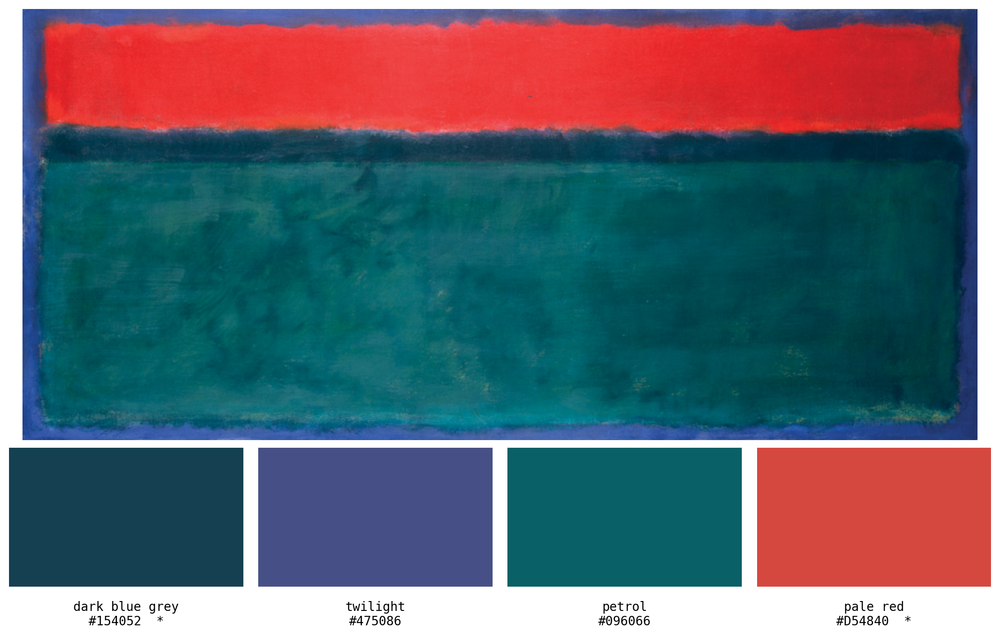
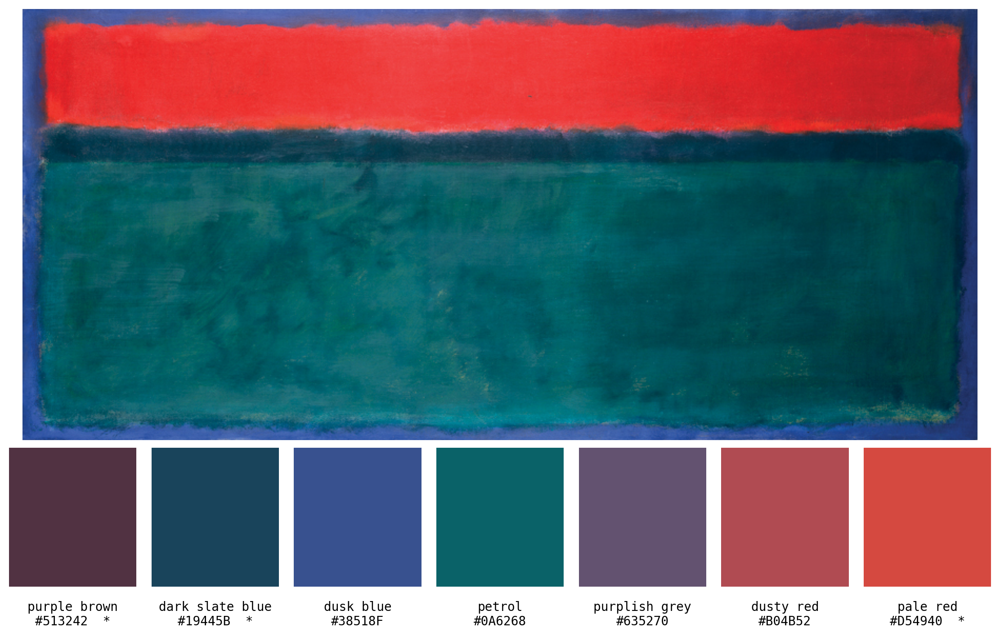

# palette

Extract a **publication-friendly color palette** from a painting.

Feed the tool an image; it picks `k` dominant colors, lightly retouches any
that fall outside the print-safe band, names each color, and writes a
side-by-side figure of the painting and its palette.



```
 #  Name                      Hex       Treated?
----------------------------------------------------
 1  dark blue grey            #154052   yes
 2  twilight                  #3D508A   no
 3  petrol                    #096066   no
 4  dark mauve                #8A5060   no
 5  pale red                  #D54940   yes
```

(`*` marks colors that were nudged for printability — the dark navy was
lifted out of press-black territory, and the red's chroma was capped.)

## Why "publication-friendly"?

Colors picked straight from a painting are not always safe to drop into a
figure for a paper. Two common failure modes:

- **Press-black / paper-white drift.** Anything with L\* < 25 will gain dot
  on press and look black; anything with L\* > 80 disappears on white paper.
- **Out-of-gamut chroma.** Highly saturated sRGB blues and greens lie
  outside CMYK and shift unpredictably when the journal prints.

This tool clips each extracted color into a conservative band and rotates
hues apart if any two colors collide perceptually. Colors that are already
safe are left **untouched** — preservation is the default.

## Install

```bash
pip install -r requirements.txt
```

Depends on `numpy`, `Pillow`, `scikit-learn`, `matplotlib`, `colorspacious`.

## Usage

```bash
# default: 5 colors, output to outputs/<image>_palette.png
python palette_picker.py imgs/Rothko.jpg

# pick a different number of colors
python palette_picker.py imgs/Rothko.jpg -k 7

# custom output path
python palette_picker.py imgs/Rothko.jpg -k 4 -o my_palette.png

# use CSS4 (148 names) instead of XKCD (~950 names)
python palette_picker.py imgs/Rothko.jpg --css
```

Or as a library:

```python
from palette_picker import pick_palette

palette = pick_palette("imgs/Rothko.jpg", k=5)
# -> [{"hex": "#154052", "name": "dark blue grey", "lab": ..., "treated": True}, ...]
```

## How it works

1. **Cluster** image pixels with k-means in **CIELab** (perceptual, not RGB).
2. **Treat** each centroid in CIELCh:
   - clip `L*` into **[25, 80]**
   - cap `C*` at **65** (very low-chroma neutrals are preserved as-is)
3. **Enforce** a minimum pairwise distance of **ΔE ≥ 15** by rotating the
   hue of the dimmer color of any too-close pair.
4. **Name** each color via nearest-neighbor in Lab against the **XKCD color
   survey** (~950 entries; switch to the 148 CSS4 names with `--css`).
5. **Check** the final palette under simulated deuteranomaly, protanomaly,
   and tritanomaly (Machado et al. 2009). If any pair drops below ΔE 12
   under any condition, a `[low]` warning is printed — the palette is not
   silently mangled to "fix" it.

### Parameters

| Flag             | Default                      | Notes                                |
| ---------------- | ---------------------------- | ------------------------------------ |
| `-k, --num-colors` | `5`                        | any positive integer                 |
| `-o, --output`   | `outputs/<image>_palette.png`| where the figure is written          |
| `--seed`         | `0`                          | k-means random seed (reproducibility)|
| `--css`          | off                          | use CSS4 names instead of XKCD       |

Constants at the top of `palette_picker.py` (`L_MIN`, `L_MAX`, `C_MAX`,
`MIN_PAIR_DELTAE`, `CVD_WARN_DELTAE`) can be edited if your venue has
tighter or looser requirements.

## Output figure

The layout adapts to the painting's aspect ratio:

- **Wide painting** (aspect ≥ 1.35): painting on top, swatch row underneath.
- **Square or portrait painting**: painting on the left, swatch column on
  the right.

Each swatch is labeled with its closest color name and hex code. Treated
colors carry a trailing `*` so a reader can tell at a glance which ones
were nudged.

## Examples

**k = 4** — the four color regions of the Rothko canvas:



**k = 7** — with more colors, k-means also picks up the transition tones
between the red band and the dark teal stripe:



## References

- Okabe & Ito (2008). *Color Universal Design.*
- Tol, Paul (2021). *Colour schemes and templates*, SRON technical note.
- Brewer, C. and Harrower, M. *ColorBrewer 2.0*. colorbrewer2.org.
- Smith, N. & van der Walt, S. (2015). *A better default colormap for matplotlib* (viridis).
- Machado, G. M., Oliveira, M. M., & Fernandes, L. A. F. (2009). *A
  physiologically-based model for simulation of color vision deficiency.*
- Sharma, G., Wu, W., Dalal, E. (2005). *The CIEDE2000 color-difference formula.*
- Ottosson, B. (2020). *A perceptual color space for image processing* (OKLab).
